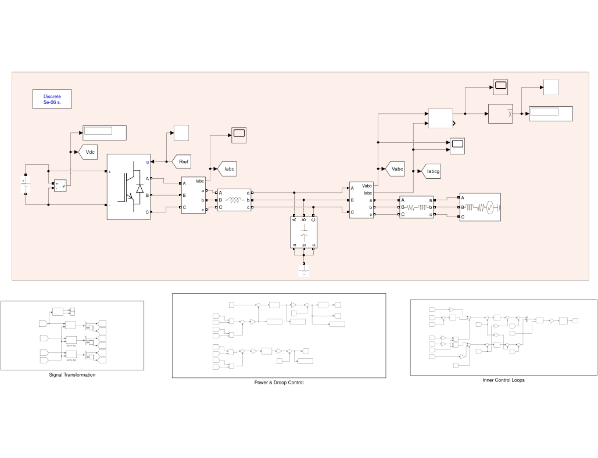
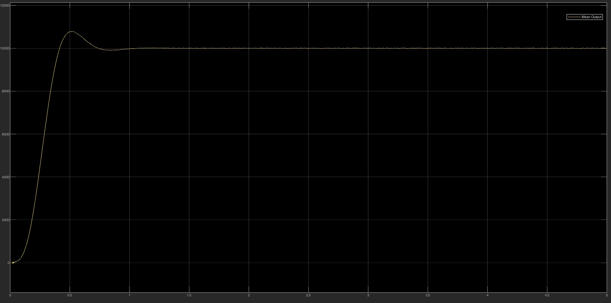
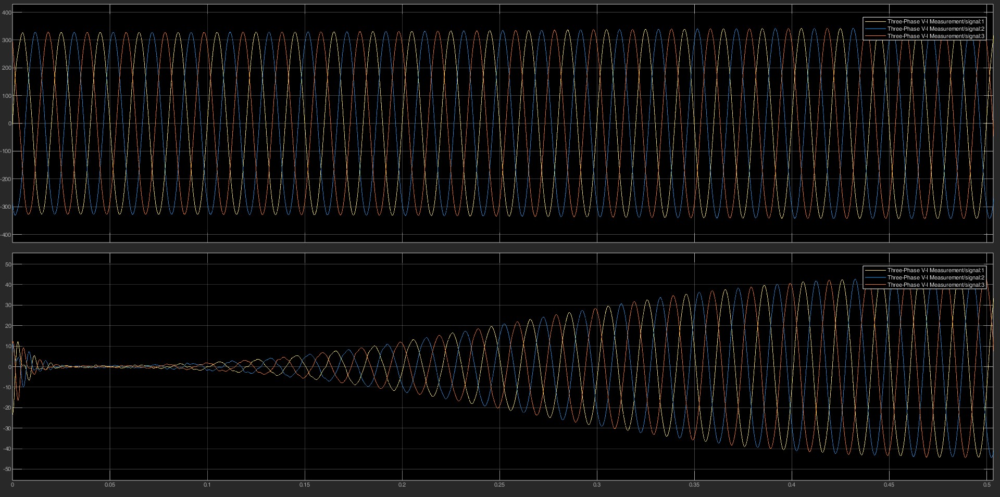

# Grid-Forming Inverter: Droop Control and Power Management

## 🚀 Overview
MATLAB/Simulink model of a **Grid-Forming Voltage Source Inverter (GFM-VSI)**. Unlike a grid-following inverter that injects current into a stiff grid, a grid-forming inverter acts as a controlled AC voltage source and sets the local voltage and frequency itself.

The inverter uses **P–ω / Q–V droop control** with cascaded voltage and current loops in the **dq0** frame, so several inverters can share active and reactive power in an isolated microgrid without communication.

## 🧠 Control Strategy
The structure imitates a synchronous generator and does not need a PLL in grid-forming operation.

### 1. Power calculation and droop
* Instantaneous P and Q are calculated and filtered by first-order low-pass filters, `30 / (s + 30)`.
* **Frequency droop (P–ω):** `ω = ω* − m_p (P − P*)`. Integrating ω gives the internal angle θ used for all transformations.
* **Voltage droop (Q–V):** `V_ref = V* − n_q · Q`.

### 2. Cascaded loops (dq0 frame)
* **Outer voltage loop (PI):** regulates the filter-capacitor voltage to `V_ref` and outputs the current references Id*, Iq*.
* **Inner current loop (PI):** regulates the inverter current, with **feed-forward decoupling terms** (±ωL·i) for independent d/q control.
* **SPWM:** the signals are transformed back to abc and compared with a **5 kHz** carrier.

## 🔧 System Parameters
| Parameter | Value |
| :--- | :--- |
| DC source | 800 V |
| Grid / output voltage | 400 V (line-to-line RMS), 50 Hz |
| Nominal phase-voltage reference V* | 326.7 V (peak) |
| Nominal active-power reference P* | 20 kW |
| Frequency droop coefficient mp | 5 × 10⁻⁵ |
| Voltage droop coefficient nq | 5 × 10⁻⁶ |
| Switching frequency | 5 kHz |
| Output filter | Third-order LCL |

## ⚙️ Simulation Results
* **Power tracking:** the mean active power settles at **20 kW** (equal to P\*) after about 1 s, with a peak of about 21.5 kW (≈ 7.5% overshoot) and no visible steady-state error. In steady state the inverter frequency equals the grid frequency, so the droop law returns P = P\*.
* **Voltage quality:** the LCL filter attenuates the 5 kHz switching harmonics, giving a clean sinusoidal output voltage under the simulated load changes.

| Active Power Output | Zoomed Waveforms |
| :---: | :---: |
|  |  |

## 📂 Repository Structure
* `Simulation/Grid_Forming.slx` — Simulink model with subsystems for power & droop control, inner control loops and signal transformation.
* `Docs/grid-forming-inverter-control.pdf` — report with equations, control theory and waveform analysis.
* `Docs/LaTeX_Source/` — LaTeX source and figures.

## ▶️ How to Run
Open `Simulation/Grid_Forming.slx` in MATLAB/Simulink (Simscape Electrical required) and press **Run**.

## 👨‍💻 Author
**Abd El-Rhman Muhammad Saad** — Electrical Power and Machines Engineering, Alexandria University.
[LinkedIn](https://linkedin.com/in/Abd-El-Rhman-Saad) · [GitHub](https://github.com/Abd-El-Rhman-Saad)